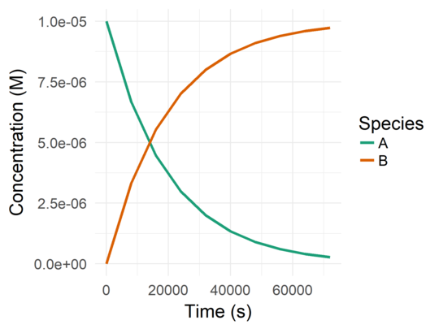
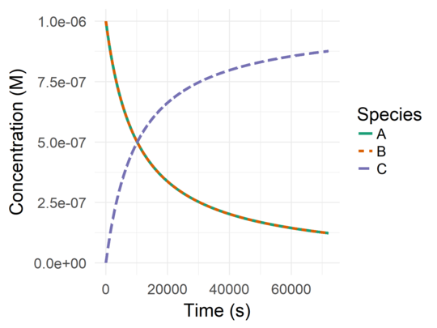
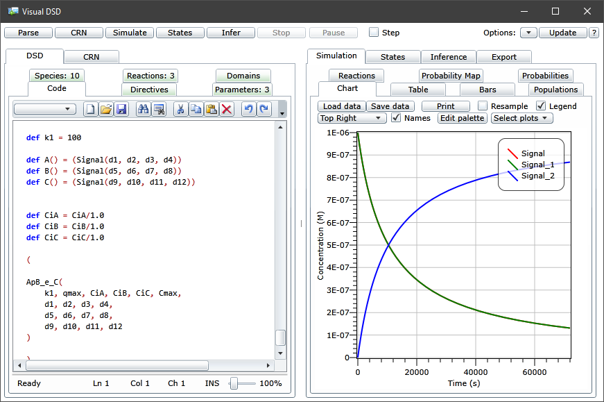
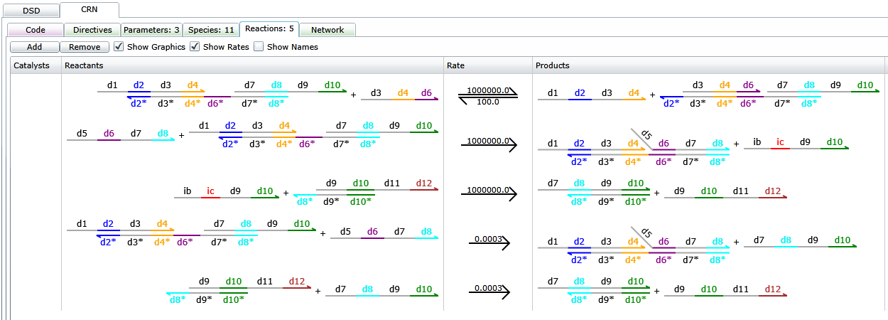
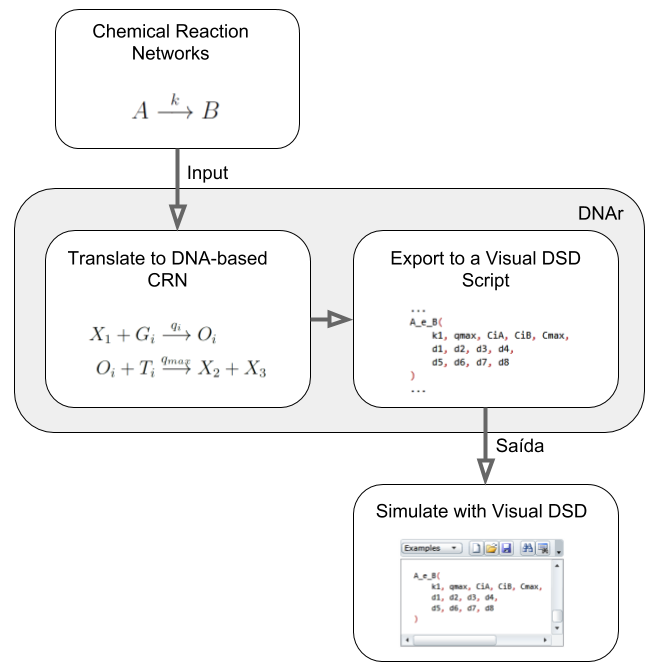
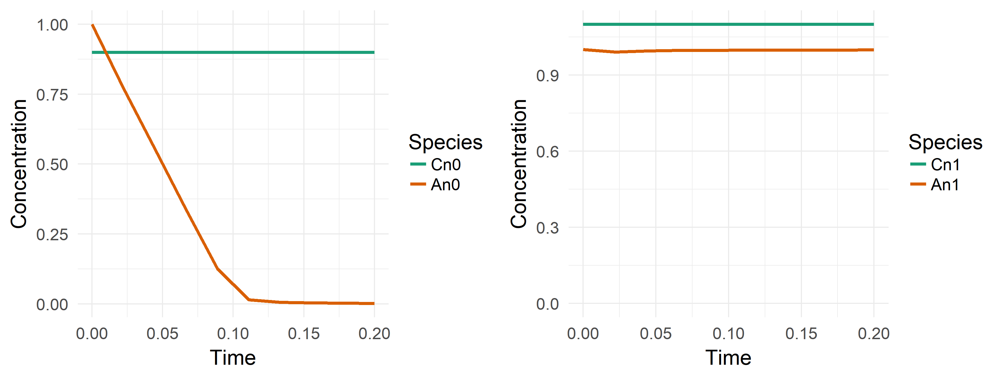

# DNAr
[](https://travis-ci.org/DanielKneipp/DNAr)
[](https://codecov.io/gh/DanielKneipp/DNAr)

This is a R package developed to design and simulate formal Chemical Reaction
Networks (CRN) and DNA-based reaction networks using Strand Displacement
reactions.

## Background

The theoretical field of Chemical Kinetics has developed brightly the last 
years, being capable of design many circuits and algorithms (such as the Message 
Passing Inference **[2]** and  a Least mean Squares Estimator **[3]**) using 
CRNs as a building block. CRNs are formed by reactions as:

```
A + B -> C,
```

where the species `A` combined with the species `B` results in the species `C` 
(a species can be a molecule of a chemical element or compound). The reaction 
also has a velocity related to it (how fast the reactants are consumed to 
generate the products).

The problem is: **what chemical elements can be used to interact the way as 
specified and with the velocity desired?** There is where the DNA comes in to 
play. 

DNA are very versatile molecule structures. `A` `B` can be DNA complexes 
designed to interact to each other in a certain way to produce another complex 
or strand `C` in a certain velocity, or even interact with another chemical 
entities to generate high fluorescence, for example (as a debugging mechanism 
or strategy to get a response from the CRN execution) **[4]**.

To ‘compile’ a formal CRN into a DNA-based one, a translation schema must be 
followed. The one used in the project is described by Soloveichik et al. 
**[1]**. Others can be implemented in a modular manner and simulated using 
the simulation functions of `DNAr` explained later on.

## Package Capabilities 

This package simulates Formal CRNs and DNA-based CRNs using a system of
ODEs (Ordinary Differential Equations) which describe the CRN's behavior
through time. This is a simplified simulation approach since it does not 
considered unintended/leaked reactions and other real-word aspects, but it's 
still useful to rapidly verify if a CRN can behaves as expected in a 
fully-controlled scenario.

Main functions and their description

| **Description**                                                                                                 | **Code Function**                                                |
|:----------------------------------------------------------------------------------------------------------------|:-----------------------------------------------------------------|
| Simulate a formal CRN                                                                                           | `react()`                                                        |
| Generate and simulate a DNA-based CRN according to the approach **[1]**                                         | `react_4domain()`                                                |
| Analyze the Ordinary Differential Equations (ODEs) used to simulate the CRN                                     | `analyze_behavior()` and `eval_derivative()`                     |
| Compare the behavior of species. Useful to track the changes of the CRN’s behavior after a change of parameters | `compare_behaviors_nrmse()`                                      |
| See, export and import the behavior of a simulated CRN                                                          | `plot_behavior()`,  `save_behavior_csv()`, `load_behavior_csv()` |
| Export the DNA-based CRN generated to the Microsoft Visual DSD (for a further in-depth simulation)              | `save_dsd_script()`                                              |

All the functions are documented and it can be accessed by typing 
`?<function-name>` in the R console (after loading the package). 
Example: `?react`.

## Who Should Use It

If you want to quickly try-out that CRN presented in a paper, or check if
an idea that you have about cyclic reaction can work using DNA, or even
tweak a CRN with new parameter values and reactions and see if it works,
this is the package for you. :thumbsup:

DNAr is designed to be simple to use and give you initial information about
a CRN (formal and DNA-based) and help you understand how it works (or why
it doesn't) by allowing fast and easy (and simplified) simulations. It is not
a package to simulate CRNs in depth, analyze leakage or potential unwanted
reactions, nor to verify the suitability of a CRN for a real-world scenario. 

## How to Install It

Firstly, using the R console, install the `devtools` package:

```R
install.packages("devtools")
```

After that, just install the `DNAr` package:

```R
library(devtools)
devtools::install_github('DanielKneipp/DNAr')
```

## How to Use It

### Simulate a formal CRN

Let’s take a look at the reaction `A --k--> B`, for example. Defining the 
initial conditions as follows:

- `[A]_0 = 1E-5 M` (Initial concentration of `A`);
- `[B]_0 = 0 M`;
- rate constant (`k`) of `5E-5 1/s`;
- time period of 72,000 seconds,

we would have the following code to simulate it:

```R
library(DNAr)  # Loading the library

# Simulating
b <- react(
    species   = c('A', 'B'),
    ci        = c(1e-5, 0),
    reactions = c('A -> B'),
    ki        = c(5e-5),
    t         = seq(0, 72000, length.out = 10)  # Using 10 time points
)
```

Firstly, the name of the species and their initial concentrations are defined 
(following the same order). Then, the reactions and their ration constants are
specified (also following the same order). Finally, the time period is defined
by given its range and the number of points to process (more points mean
more accurate and time-consuming simulations)

All the simulated behavior is held by the `b` variable. By typing `b` in the 
console you can see the variation of the concentrations throughout time.

```R
> b
    time            A            B
1      0 1.000000e-05 0.000000e+00
2   8000 6.671976e-06 3.328024e-06
3  16000 4.462676e-06 5.537324e-06
4  24000 2.990997e-06 7.009003e-06
5  32000 2.004515e-06 7.995485e-06
6  40000 1.343019e-06 8.656981e-06
7  48000 8.997926e-07 9.100207e-06
8  56000 6.028607e-07 9.397139e-06
9  64000 4.039198e-07 9.596080e-06
10 72000 2.706274e-07 9.729373e-06
```

To plot the result, just do:

```R
plot_behavior(
    b,
    x_label     = 'Time (s)',
    y_label     = 'Concentration (M)',
    legend_name = 'Species'
)
```

This code will yield the following plot:




To see more examples with multiple reactions, just type `?react` in the
R console.


### Simulate a DNA-based CRN

To generate and simulate a DNA-based CRN, the function called `react_4domain()`
is used. A few more parameters must be defined in contrast to `react()`. 
The parameters used to simulate a formal CRN remains the same. `species`, `ci`,
`reactions`, `ki` and `t` should be defined exactly like a formal CRN. `qmax`,
`cmax`, `alpha` and `beta` are new parameters which must be specified following
the guidelines described by **[1]**.

The `react_4domain()` will automatically generate a DNA-based CRN correspondent
to the formal CRN specified (following the approach **[1]**) and simulated it.

As an example, let's simulate the reaction `A + B --> C`.

```R
r <- react_4domain(
    species   = c('A', 'B', 'C'),
    ci        = c(1e-6, 1e-6, 0),
    reactions = c('A + B -> C'),
    ki        = c(1e2),
    qmax      = 1e6, cmax = 1e-4,
    alpha     = 1,   beta = 1,
    t         = seq(0, 72000, length.out = 10)
)
```

`r` holds information about the CRN that was actually simulated (the DNA-based 
one) and the behavior obtained from it. These are the attributes of `r`:

| **Attribute**                                 | **Description**                                                               |
|:----------------------------------------------|:------------------------------------------------------------------------------|
| `r$behavior`                                  | The behavior of the DNA-based CRN (like the data table returned by `react()`) |
| `r$species`, `r$ci`, `r$reactions` and `r$ki` | The DNA-based CRN with its parameters (used to simulate it with `react()`)    |

By typing `r$reactions`, you can see the DNA reactions used to emulate the 
behavior of the formal CRN (`A + B -> C` in this case).

```R
> r$reactions
[1] "A + L1 --> H1 + W1"    "H1 + W1 --> A + L1"    "B + H1 --> O1"    "O1 + T1 -->  C"
```

Notice that these reactions are the same as the ones shown in the Figure 3 from 
**[1]**, where `A = X_1`, `B = X_2`, `C = X_3` and `W1 = B_i`.

The initial concentrations of the species and the rate constant of the reactions
also can changed. However, the overall behavior of the formal species in the 
DNA-based CRN should be quite similar to the formal one.

To plot the results, the same `plot_behavior()` function can be used:

```R
plot_behavior(
    r$behavior,
    x_label            = 'Time (s)',
    y_label            = 'Concentration (M)',
    legend_name        = 'Species',
    species            = c('A', 'B', 'C'),
    variable_line_type = TRUE
)
```

Note that a `species` parameter is now being specified. This selects the 
species to be plotted. If you want to see the behavior of all the auxiliary 
species, just remove this parameter definition. 

The species `A` and `B` will have the same behavior. To allow us to both species
in the plot, the parameter `variable_line_type` is set to TRUE, making the line
types vary according to the species.

This code will yield the following result:



### Analyzing its behavior

In order to simplify the process of analyze and understand the behavior of a
CRN, `analyze_behavior()` shows the derivatives used for the simulation. Given
the CRN parameters, it returns the derivatives for each species. 

```R
d <- analyze_behavior(
    species   = c('A', 'B', 'C'),
    ci        = c(1e-5, 0, 1e-8),
    reactions = c('A -> B',
                  'A -> C'),
    ki        = c(5e-5,
                  3e-5)
)
```

```R
> d['A']
                                          A
1 d[A]/dt = (-5e-05 * [A]) + (-3e-05 * [A])
```

You also can pass the behavior to it allowing you to analyze the values 
of each derivative variables in selected points in time. In the following code
the derivate of `A` is shown at initial conditions.

```R
b <- react(
    species   = c('A', 'B', 'C'),
    ci        = c(1e-5, 0, 1e-8),
    reactions = c('A -> B',
                  'A -> C'),
    ki        = c(5e-5,
                  3e-5),
    t         = seq(0, 72000, length.out = 10)
)

d <- analyze_behavior(
    species     = c('A', 'B', 'C'),
    ci          = c(1e-5, 0, 1e-8),
    reactions   = c('A -> B',
                    'A -> C'),
    ki          = c(5e-5,
                    3e-5),
    behavior    = b,
    time_points = c(1) # Selecting the first time point
)
```

```R
> d['A']
                                                    A
1 d[A]/dt = (-5e-05 * 1e-05[A]) + (-3e-05 * 1e-05[A])
```

Now you can see the concentration of `A` at initial conditions (alongside each 
`[A]`).

To see if the concentration of `A` will decrease or increase at this time point,
just evaluate the derivative with:

```R
> eval_derivative(d['A'])
[1] -8e-10
```

The resultant signal shows if `[A]` will increase or decrease (decrease in this
case), and the absolute value indicates the rate of change.

To better understand why the derivative of `A` has this value, 
`eval_derivative_part()` can be used to evaluate each parenthesis of
the derivative separately. This will indicate how each reaction that interacts 
with `A` is contributing to that value.

```R
> eval_derivative_part(d['A'])
(-5e-05 * 1e-05[A]) (-3e-05 * 1e-05[A]) 
             -5e-10              -3e-10
```

It returns a vector of double where each position is the evaluation result of a 
parenthesis of the derivative. Each position is also named with the textual
representation of the parenthesis itself. With this, we can conclude that the 
first reaction (`A -> B` with `k = 5e-5`) is impacting more to the decrease of 
`[A]` than the second reaction.

> You can select multiple time points to analyze. `time_points = c(1, 10)` will
select the first and last time points, in this case. The evaluation of the last 
time point (of two selected) can be done with `eval_derivative(d[[2]]['A'])`.

#### Analyzing DNA-based CRNs

For DNA-based CRNs, the only change is to use the CRN parameters (`species`, 
`ci`, `reactions`, `ki`) returned by `react_4domain()` in order to analyze 
the DNA-based CRN itself instead of the formal one which it emulates.

### Working with Microsoft Visual DSD

[Microsoft Visual DSD](https://www.microsoft.com/en-us/research/project/programming-dna-circuits/#!download)
**[5]** is a tool that can be used to design and simulate computational devices
made with DNA using DNA Strand Displacement (DSD) reactions. It has its own
language to describe the device and the initial conditions of the system.
For a more detailed simulation, including stochastic simulation with unintended
reactions and even suggestion of the DNA sequences to use for each species, 
this tool is up for the task.

The reason why we're talking about it is because DNAr can export DNA-based
CRNs to VIsual DSD as a pre-coded file which can be used as a framework
to start simulating your CRN in a more detailed manner.

Let's start with our first CRN used in DNA-based simulations, `A + B -> C`:

```R
save_dsd_script(
    species   = c('A', 'B', 'C'),
    ci        = c(1e-6, 1e-6, 0),
    reactions = c('A + B -> C'),
    ki        = c(1e2),
    qmax      = 1e6, cmax = 1e-4,
    alpha     = 1,   beta = 1,
    t         = seq(0, 72000, length.out = 10),
    filename  = 'script.dna'
)
```

This code will save a file name `"script.dna"` in the current directory of the
R session. Opening it with the Visual DSD and pressing `"Simulate"` in the top 
left should leave you with a interface like this:



*Note that we didn't specified a DNA-based CRN nor a device with the Visual DSD
language in any step. We've made from a formal CRN to a DSD-based device 
directly without any particular knowledge of the specification language used
by Visual DSD nor the approach used to translate a formal CRN do a DNA-based 
one.*

And finally, you can use Visual DSD features to better understand the device's
behavior. A cool example the next image, where you can see what reactions are
actually happening, and even see how the domains are interacting with each 
other.



However, as mentioned before, the file generated should be used as a framework.
In fact, this entire process is not intended to happen automatically. The user
must have the knowledge to set realistic values for the parameters in the
formal to DNA-based translation step, as well as understand the features
available in the Visual DSD in order to enable more detailed analysis and
react properly to the different responses of the software. The main point is 
to show how it easy it is to get started with the process.

> The version of Visual DSD used in this simulation was v0.14-20160312-35147

So, the image below summarizes the process described above.



## Package Expandability

One of the key features of DNAr that worths mentioning is its expandability.
Since DNAr provides its simulation capabilities through an API (and not 
human-dependent interfaces), code can be written on top of DNAr to generate and 
simulate large-scale complex CRNs. Furthermore, given the fact that the 
implementations of `react()` and `react_4domain()` are independent, other 
approaches of translating formal CRN into DNA-based ones can be implemented 
without any change in the existent code (assuming that the approach also
yield a CRN as the of the translation).

A good example of this expandability can be shown using the approach of
building neural networks discussed by **[6]**.

### Example: Chemical Neurons

The work of **[6]** presents an approach to implement a McCulloch–Pitts 
artificial neuron model (which is a binary neuron) using CRNs. Thus, the 
authors could build artificial neural networks and logic
gates on top of that.

How the approach works is beyond the scope of this documentation, but we'll show
how you can use an external implementation code to simulate logic gates 
designed with chemical artificial neurons, without even fully understanding how 
it works.

Within the DNAr package (`R/neuron_hjelmfelt.R` file), a set of functions 
(which works as a plug-in for DNAr) were implement to build artificial chemical 
neurons, artificial neural networks and some logic gates (AND, OR, Majority 
gate). For this documentation, we'll stick to the most basic example: the 
stand-alone neuron.

To define a neuron, we do the following:

```R
n <- get_neuron_hje('n0', input_ci = 0.9)
```

With this, we have defined a neuron with input `0.9`. The activation rule for this neuron
is:

- *activated*: if the input concentration is `<= 0.9`;
- *deactivated*: if the input concentrations is `>= 1.1`.

Between `0.9` and `1.1`, the neuron's behavior gets undefined.

So, all the CRN is defined in `n`, therefore we can simulate it and see the
behavior of the species which defines its behavior:

- `Cn0`: the input species;
- `An0`: defines the neuron state. If it's different than 0, the neuron is 
activated.

```R
b <- react(
    species   = n$species,
    ci        = n$ci,
    reactions = n$reactions,
    ki        = n$ki,
    t         = seq(0, 0.2, length.out = 10)
)

plot_behavior(b, species = c('Cn0', 'An0'))
```

The result of the above simulation is the left side of the below Figure. The
right side is the result when `input_ci = 1.1`.



And if you want to simulate a DNA-based CRN of the neuron, it is also fairly
direct to do it. The only concern is to define proper values for `qmax` and
`cmax`. For the purpose of this documentation, values direct dependent of
the neuron CRN parameters are defined. `alpha` and `beta` are used just to 
rescale the other CRN parameters (see **[1]**), therefore we'll leave them equal 
`1` to keep the other parameters as they are.

```R
r <- react_4domain(
    species   = n$species,
    ci        = n$ci,
    reactions = n$reactions,
    ki        = n$ki,
    t         = seq(0, 0.2, length.out = 10),
    cmax      = max(n$ci) * 1e4,
    qmax      = max(n$ki) * 1e4,
    alpha     = 1, beta = 1
)

plot_behavior(r$behavior, species = c('Cn0', 'An0'))
```

### Other example

Another good plug-in example is the set of functions implementing the approach
of **[7]** of building logic gates directly with CRNs (without artificial 
neurons or other building block). 

This plug-in implemented as a separated package
called [DNArLogic](https://github.com/renanmarks/DNArLogic) **[8]**
serves as another good example on how another pieces of software can be
built on top of DNAr to create and simulate much more complex CRNs, focusing
less on the Chemical Kinetics theory particularities, and more in higher level 
abstractions in order to solve problems.

The rule of thumb is this: If the code can yield a formal CRN with all the 
parameters required by `react()`, it can be built on top of DNAr. So feel free
to implement a plug-in yourself. Two good yet not done examples of approaches
to build CRNs for a specific purposes are **[2]** and **[3]**.

## References

- **[1]** Soloveichik, David, Georg Seelig, and Erik Winfree. "DNA
as a universal substrate for chemical kinetics." Proceedings of the
National Academy of Sciences 107.12 (2010): 5393-5398.

- **[2]** Napp, N. E. & Adams, R. P. (2013). Message passing inference with 
chemical reaction networks. Em Advances in neural information processing 
systems, pp. 2247--2255.

- **[3]** Zechner, C. & Khammash, M. (2016). A molecular implementation of the 
least mean squares estimator. Em Decision and Control (CDC), 2016 IEEE 55th 
Conference on, pp. 5869--5874. IEEE.

- **[4]** Chen, Y.-J.; Groves, B.; Muscat, R. A. & Seelig, G. (2015). Dna 
nanotechnology from the test tube to the cell. Nature nanotechnology, 
10(9):748--760.

- **[5]** Lakin, M. R.; Youssef, S.; Polo, F.; Emmott, S. & Phillips, A. (2011). 
Visual dsd: a design and analysis tool for dna strand displacement systems. 
Bioinformatics, 27(22):3211--3213.

- **[6]** Hjelmfelt, A.; Weinberger, E. D. & Ross, J. (1991). Chemical 
implementation of neural networks and turing machines. Proceedings of the 
National Academy of Sciences, 88(24):10983--10987.

- **[7]** Jiang, H.; Riedel, M. D. & Parhi, K. K. (2013). Digital logic with 
molecular reactions. Em Computer-Aided Design (ICCAD), 2013 IEEE/ACM 
International Conference on, pp. 721--727. IEEE.

- **[8]** Marks, R. A.;  Vieira, D. K. S.; Guterres, M. V.; Oliveira, P. A. C. & Neto, O. P. V. (2019). DNAr-logic: a constructive DNA logic circuit design library in R language for molecular computing. In Proceedings of the 32nd Symposium on Integrated Circuits and Systems Design (SBCCI '19). Association for Computing Machinery, New York, NY, USA, Article 12, 1–6. DOI:https://doi.org/10.1145/3338852.3339854
